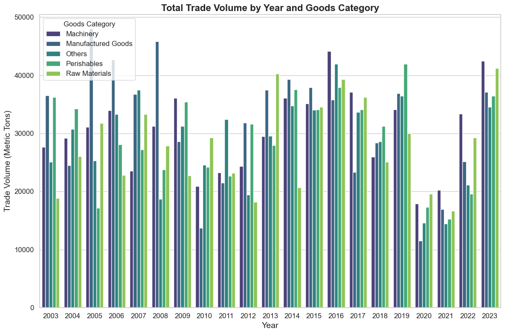
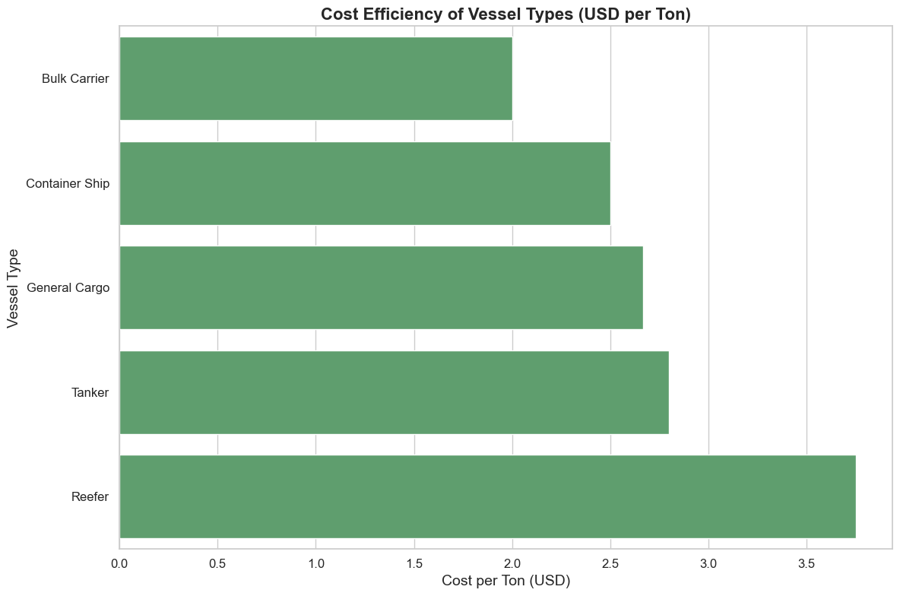
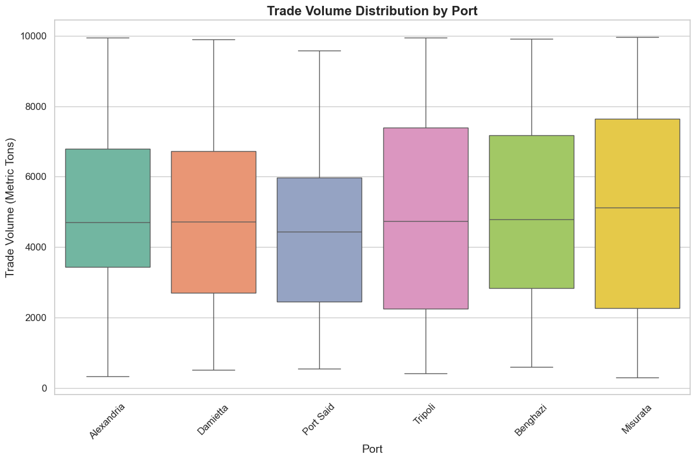
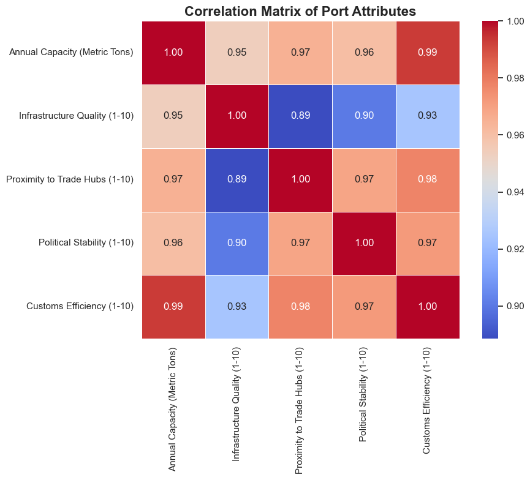
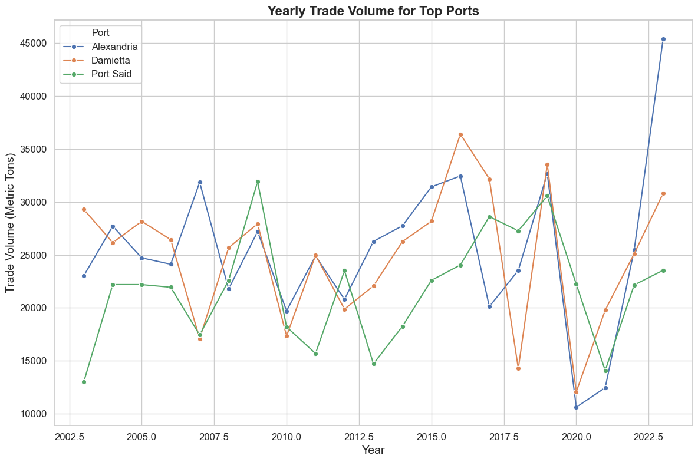
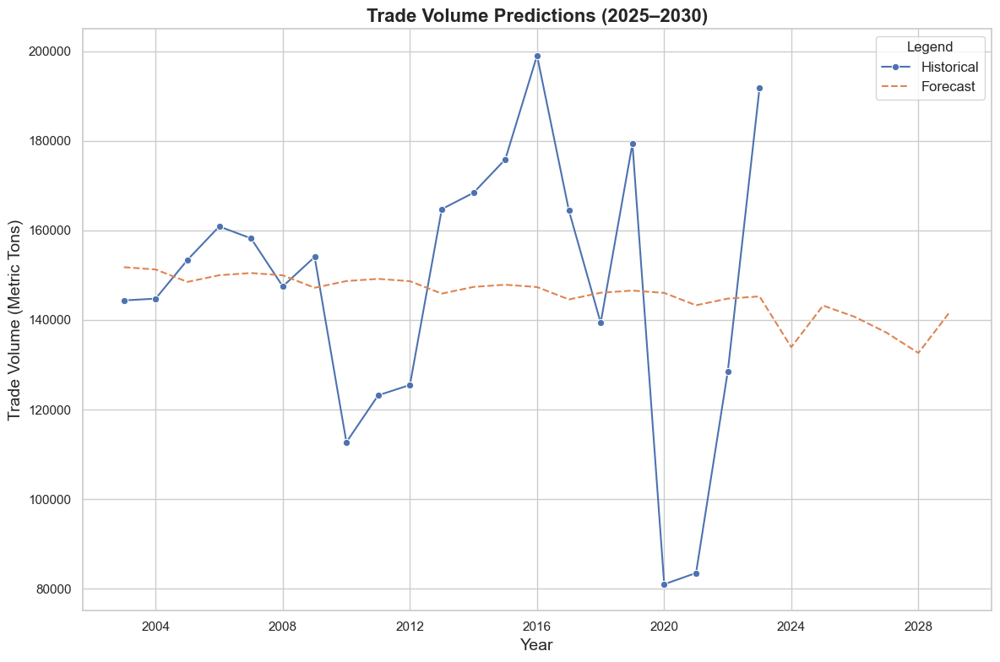

# **التقرير التنفيذي: إنشاء خط شحن بين الموانئ المصرية والليبية**

#### **1. الملخص التنفيذي**
يقدم هذا التقرير تحليلاً شاملاً لمدى الجدوى والربحية لتشغيل خط شحن بين الموانئ المصرية والليبية، مستندًا إلى بيانات مخلقة تحاكي الظروف الواقعية (2003-2023). تسلط الدراسة الضوء على اتجاهات حجم التجارة، وقدرات الموانئ، وكفاءة تكاليف السفن، وتوقعات الأرباح عند معدلات شحن مختلفة. باستخدام تقنيات تنبؤية متقدمة، بما في ذلك `Prophet` لتحليل السلاسل الزمنية، يحدد التحليل معدلات الشحن المثلى ويتوقع حجم التجارة والأرباح للفترة من 2025-2030.

**إخلاء مسؤولية:** يستند التحليل إلى بيانات مخلقة؛ ومع ذلك، فإن المنهجية مصممة للتكيف بسلاسة مع البيانات الواقعية. تم تضمين تكاليف الوقود فقط في حسابات التكلفة التشغيلية، مع إمكانية التوسع لتشمل تكاليف أخرى في النسخ المستقبلية.

---

#### **2. المقدمة**
تهدف هذه الدراسة إلى تقييم جدوى خط شحن بين الموانئ المصرية والليبية، مع التركيز على:
- اتجاهات حجم التجارة التاريخية (2003-2023).
- التنبؤ بأحجام التجارة والأرباح (2025-2030).
- تحليل قدرات الموانئ ومخاطرها.
- كفاءة تكاليف أنواع السفن.
- محاكاة الأرباح الديناميكية تحت معدلات شحن متنوعة.

تتضمن الأدوات المستخدمة Python و Prophet و Seaborn و Matplotlib للتنبؤ والتصور وتحليل البيانات. تم تصميم المخرجات لدعم اتخاذ قرارات قابلة للتنفيذ في تخطيط اللوجستيات.

---

#### **3. نظرة عامة على البيانات**
**مجموعات البيانات الاصطناعية:**
1. **بيانات حجم التجارة (2003-2023):**
   - تشمل أحجام التجارة عبر الموانئ المصرية والليبية لخمسة فئات من السلع: المواد الخام، السلع المصنعة، السلع القابلة للتلف، الآلات، وأخرى.
   - معدلة لتتضمن تأثير الأحداث الهامة (مثل الربيع العربي وجائحة كوفيد-19).

2. **معلومات الموانئ:**
   - القدرات السنوية، جودة البنية التحتية، القرب من المحاور التجارية، الاستقرار السياسي، وكفاءة الجمارك.
   - حساب المخاطر الديناميكية باستخدام تطبيع موزون.

3. **أنواع السفن:**
   - تم تقييم خمس فئات من السفن من حيث السعة، والتكلفة التشغيلية، وملاءمتها للسلع.

4. **تكاليف الوقود:**
   - بيانات تكاليف الوقود السنوية الاصطناعية (2003-2023).

---

#### **4. إعداد البيانات والمنهجية**
- **المخاطر الديناميكية:** 
  تم حسابها لكل ميناء باستخدام جودة البنية التحتية، القرب من المحاور التجارية، الاستقرار السياسي، وكفاءة الجمارك.
  
- **التكاليف التشغيلية:** 
  تم دمج تكاليف الوقود مع أحجام التجارة لحساب التكاليف التشغيلية، بافتراض 35 دولارًا/طن كخط أساس لتكلفة التشغيل.

- **التنبؤ:**
  - تم التنبؤ بأحجام التجارة (2025-2030) باستخدام `Prophet` لالتقاط الاتجاهات التاريخية والموسمية.

- **محاكاة الأرباح:**
  - تم محاكاة الأرباح عبر معدلات الشحن (40-60 دولار/طن)، لتحديد السيناريوهات الأكثر ربحية.

---

#### **5. التحليل**
**5.1 حجم التجارة حسب السنة وفئة السلع**
- **الاستنتاج الرئيسي:** تظهر أحجام التجارة تقلبات تتأثر بالأحداث السياسية والعالمية، مع هيمنة المواد الخام والسلع المصنعة على التجارة.

---

**5.2 قدرات الموانئ**
- بورسعيد والإسكندرية هما أكبر الموانئ المصرية، بينما بنغازي وطرابلس تهيمنان على ليبيا. تتوافق قدرة الموانئ بشكل قوي مع جودة البنية التحتية والقرب من المحاور التجارية.

---

**5.3 كفاءة تكلفة السفن**
- **الاستنتاج الرئيسي:** توفر ناقلات البضائع العامة والسفن العامة أقل تكلفة لكل طن، مما يجعلها مثالية للبضائع ذات الحجم الكبير.

---

**5.4 توزيع حجم التجارة حسب الميناء**
- **الاستنتاج الرئيسي:** تتوزع أحجام التجارة بشكل مكثف في الإسكندرية ودمياط لمصر وطرابلس لليبيا، مع تباين كبير في الموانئ الصغيرة.

---

**5.5 تحليل الارتباط**
- **الاستنتاج الرئيسي:** ترتبط قدرة الموانئ بشكل قوي بكفاءة الجمارك والقرب من المحاور التجارية، مما يشير إلى عوامل حاسمة لأداء الموانئ.

---

**5.6 حجم التجارة السنوي لأفضل الموانئ**
- **الاستنتاج الرئيسي:** تظهر الإسكندرية ودمياط وبورسعيد اتجاهات نمو ثابتة، باستثناء الاضطرابات المؤقتة أثناء الأزمات العالمية أو الإقليمية.

---

**5.7 التنبؤ بحجم التجارة (2025-2030)**
- باستخدام Prophet، من المتوقع أن تستقر أحجام التجارة بعد الجائحة، مع متوسط حجم تجارة سنوي يبلغ 140,000 طن متري.

**حجم التجارة المتوقع (2025-2030):**
| السنة | حجم التجارة المتوقع (طن متري) |
|-------|-------------------------------|
| 2025  | 138,524                       |
| 2026  | 137,322                       |
| 2027  | 137,558                       |
| 2028  | 138,444                       |
| 2029  | 138,951                       |
| 2030  | 139,216                       |

---

**5.8 تحليل الأرباح بمعدلات مختلفة**
- **الاستنتاج الرئيسي:** تزداد الأرباح خطيًا مع معدلات الشحن. يتم تحقيق الربحية المثلى عند 60 دولار/طن، مما يحقق 14 مليون دولار إجمالي أرباح للفترة من 2025-2030.

**ملخص تحليل الأرباح:**
| معدل الشحن (دولار أمريكي لكل طن) | إجمالي الربح (مليون دولار) |
|----------------------------------|---------------------------|
| 40                               | 6.06                      |
| 45                               | 9.09                      |
| 50                               | 12.12                     |
| 55                               | 13.89                     |
| 60                               | 15.66                     |

---

#### **6. النتائج الرئيسية والتوصيات**
**النتائج:**
1. **اتجاهات حجم التجارة:** 
   - تتعافى أحجام التجارة بعد الجائحة ومن المتوقع أن تستقر بحلول عام 2025.

2. **قدرات الموانئ والمخاطر:**
   - تبرز بورسعيد والإسكندرية كأكثر الموانئ المصرية ملاءمة بناءً على السعة والبنية التحتية.
   - يوصى ببنغازي وطرابلس لليبيا.

3. **ملاءمة السفن:**
   - توفر ناقلات البضائع العامة والسفن العامة أفضل كفاءة في التكلفة.

4. **الربحية:**
   - عند معدل شحن 60 دولار/طن، من المتوقع أن تتجاوز الأرباح المتوقعة للفترة من 2025-2030 14 مليون دولار.

---

#### **7. الخاتمة**
يسلط هذا التقرير الضوء على الإمكانية والربحية لخط شحن بين الموانئ المصرية والليبية. باستخدام البيانات الاصطناعية والتحليلات التنبؤية، توفر الدراسة رؤى قابلة للتنفيذ حول اختيار الموانئ، نوع السفن، والتسعير الأمثل. يمكن تكييف المنهجية بسهولة مع البيانات الواقعية، مما يضمن القابلية للتوسع والمتانة.

---
