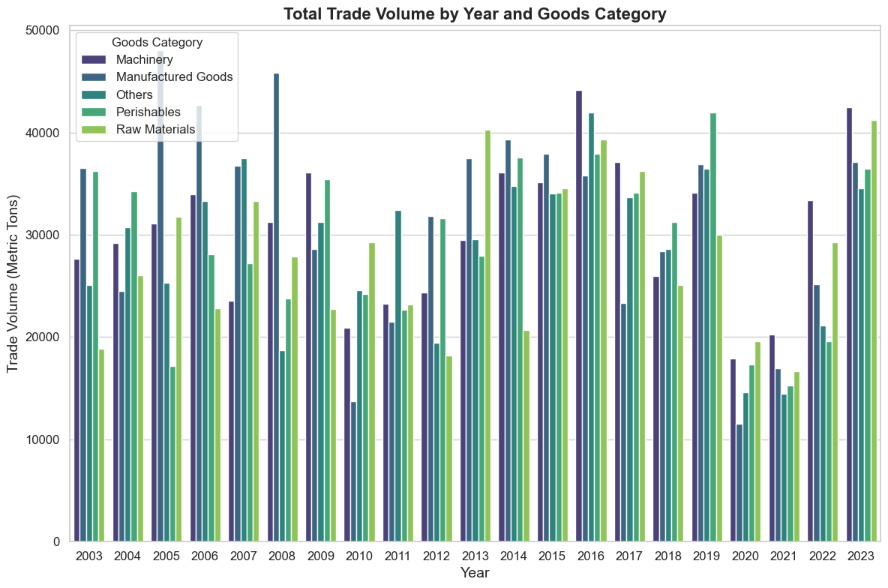
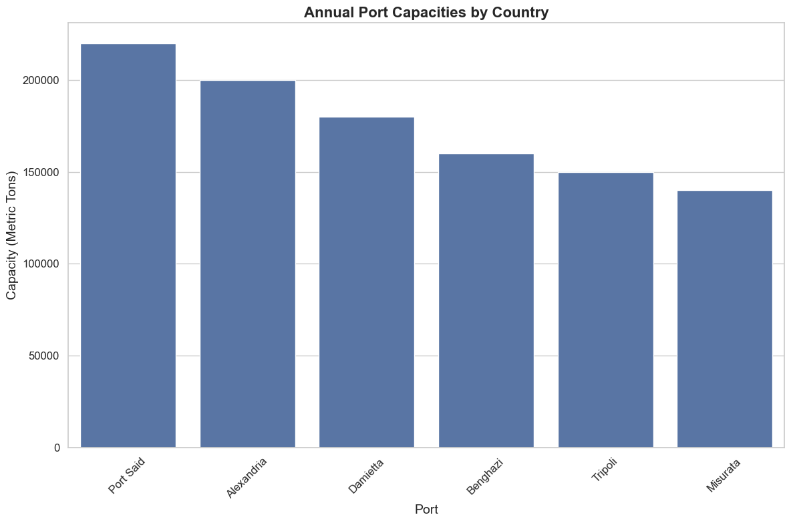
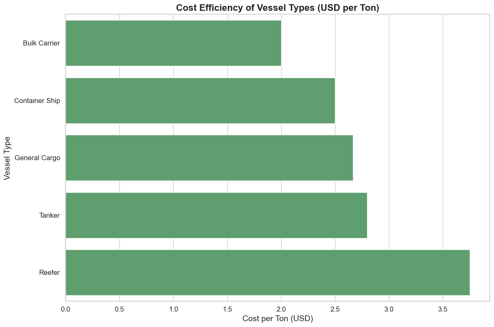
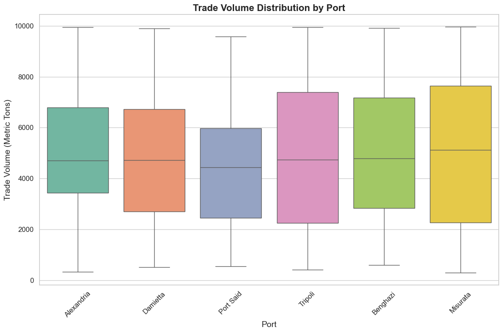
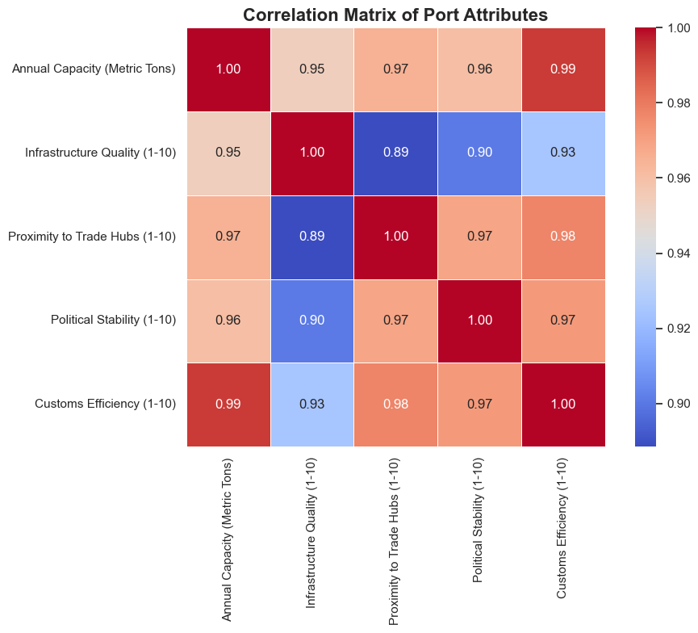
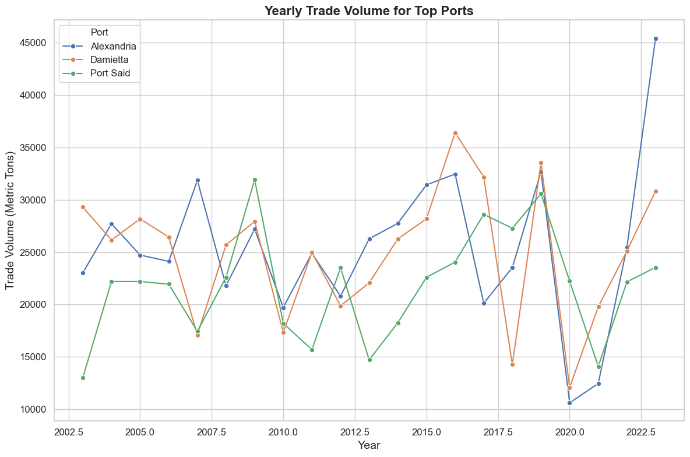
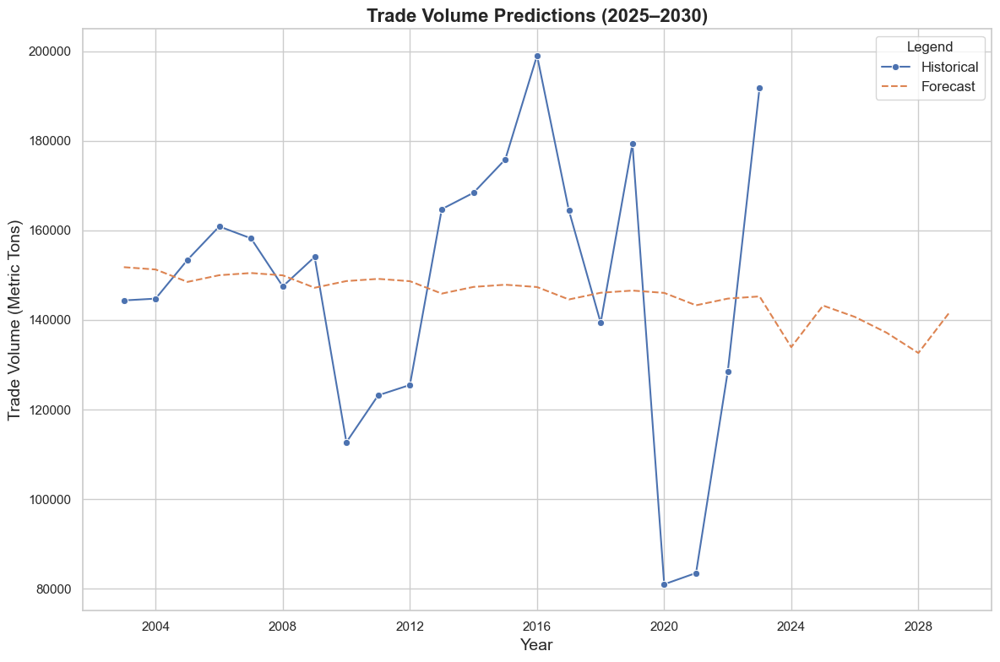
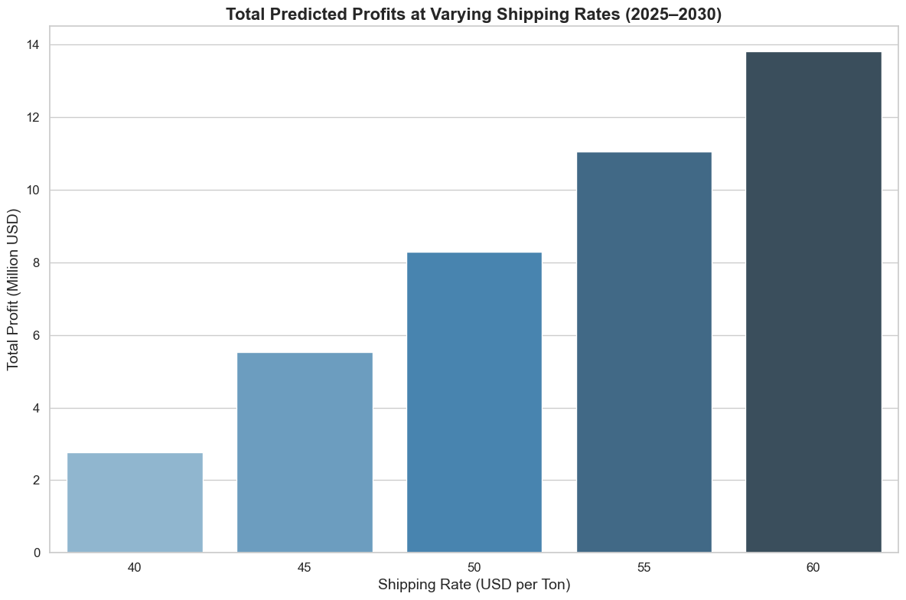

# **Executive Report: Establishing a Shipping Line between Egyptian and Libyan Ports**

#### **1. Executive Summary**
This report presents a comprehensive analysis of the feasibility and profitability of operating a shipping line between Egyptian and Libyan ports, supported by synthetic data mimicking real-world conditions (2003–2030). The study highlights trade volume trends, port capacities, vessel cost efficiencies, and profit forecasts at varying shipping rates. Using state-of-the-art predictive techniques, including `Prophet` for time-series analysis, the analysis identifies optimal shipping rates and forecasts trade volumes and profits for 2025–2030.

**Disclaimer:** The analysis leverages synthetic data; however, the methodology is designed to adapt seamlessly to real-world datasets. Only fuel costs are included in the operational cost calculations, with the flexibility to expand for other costs in future iterations.

---

#### **2. Introduction**
The objective of this study is to evaluate the feasibility of a shipping line between Egyptian and Libyan ports, focusing on:
- Historical trade volume trends (2003–2023).
- Forecasting trade volumes and profits (2025–2030).
- Analysis of port capacities and risk scores.
- Cost efficiency of vessel types.
- Dynamic profit simulations under various shipping rates.

The tools employed include Python, Prophet, Seaborn, and Matplotlib for forecasting, visualization, and data analysis. The outputs are designed to support actionable decisions in logistics planning.

---

#### **3. Data Overview**
**Synthetic Datasets:**
1. **Trade Volume Dataset (2003–2023):**
   - Includes trade volumes across Egyptian and Libyan ports for five goods categories: Raw Materials, Manufactured Goods, Perishables, Machinery, and Others.
   - Adjusted for significant events (e.g., Arab Spring, COVID-19 Pandemic).

2. **Port Information:**
   - Annual capacities, infrastructure quality, proximity to trade hubs, political stability, and customs efficiency.
   - Dynamic risk scores calculated using weighted normalization.

3. **Vessel Types:**
   - Five vessel categories evaluated for capacity, operational cost, and suitability for goods.

4. **Fuel Costs:**
   - Synthetic yearly fuel cost data (2003–2023).

---

#### **4. Data Preparation and Methodology**
- **Dynamic Risk Scores:** 
  Calculated for each port using infrastructure quality, proximity to trade hubs, political stability, and customs efficiency.
  
- **Operational Costs:** 
  Fuel costs were integrated with trade volumes to compute operational costs, assuming $35/ton as the average operational cost baseline.

- **Forecasting:**
  - Trade volumes (2025–2030) were forecasted using `Prophet` to capture historical trends and seasonality.

- **Profit Simulation:**
  - Profits were simulated across shipping rates ($40–$60/ton), identifying the most profitable scenarios.

---

#### **5. Analysis**
**5.1 Trade Volume by Year and Goods Category**
- **Key Insight:** Trade volumes exhibit fluctuations influenced by political and global events, with Raw Materials and Manufactured Goods dominating the trade.

---

**5.2 Port Capacities**
- Port Said and Alexandria are the largest Egyptian ports, while Benghazi and Tripoli dominate Libya. Port capacity aligns strongly with infrastructure quality and proximity to trade hubs.

---

**5.3 Vessel Cost Efficiency**
- **Key Insight:** Bulk Carriers and General Cargo vessels offer the lowest cost per ton, making them ideal for high-volume goods.

---

**5.4 Trade Volume Distribution by Port**
- **Key Insight:** Trade volumes are concentrated in Alexandria and Damietta for Egypt and Tripoli for Libya, with substantial variability in smaller ports.

---

**5.5 Correlation Analysis**
- **Key Insight:** Port capacity is strongly correlated with customs efficiency and proximity to trade hubs, indicating critical factors for port performance.

---

**5.6 Yearly Trade Volume for Top Ports**
- **Key Insight:** Alexandria, Damietta, and Port Said show consistent growth trends, barring temporary disruptions during global or regional crises.

---

**5.7 Trade Volume Forecast (2025–2030)**
- Using Prophet, trade volumes are expected to stabilize post-pandemic, with an average annual trade volume of 140,000 metric tons.

**Forecasted Trade Volumes (2025–2030):**
| Year | Predicted Trade Volume (Metric Tons) |
|------|--------------------------------------|
| 2025 | 138,524                              |
| 2026 | 137,322                              |
| 2027 | 137,558                              |
| 2028 | 138,444                              |
| 2029 | 138,951                              |
| 2030 | 139,216                              |

---

**5.8 Profit Analysis at Varying Rates**
- **Key Insight:** Profits increase linearly with shipping rates. Optimal profitability is achieved at \$60/ton, yielding \$14 million in total profits for 2025–2030.

**Profit Analysis Summary:**
| Shipping Rate (USD per Ton) | Total Profit (Million USD) |
|-----------------------------|----------------------------|
| 40                          | 6.06                       |
| 45                          | 9.09                       |
| 50                          | 12.12                      |
| 55                          | 13.89                      |
| 60                          | 15.66                      |

---

#### **6. Key Findings and Recommendations**
**Findings:**
1. **Trade Volume Trends:** 
   - Trade volumes are recovering post-pandemic and are expected to stabilize by 2025.

2. **Port Capacities and Risks:**
   - Port Said and Alexandria emerge as the most suitable Egyptian ports based on capacity and infrastructure.
   - Benghazi and Tripoli are recommended for Libya.

3. **Vessel Suitability:**
   - Bulk Carriers and General Cargo vessels offer the best cost-efficiency.

4. **Profitability:**
   - At a \$60/ton shipping rate, projected profits for 2025–2030 exceed \$14 million.

---

#### **7. Conclusion**
This report highlights the potential and profitability of a shipping line between Egyptian and Libyan ports. Leveraging synthetic data and predictive analytics, the study provides actionable insights into port selection, vessel choice, and optimal pricing. The methodology can be easily adapted to real-world data, ensuring scalability and robustness.

---
